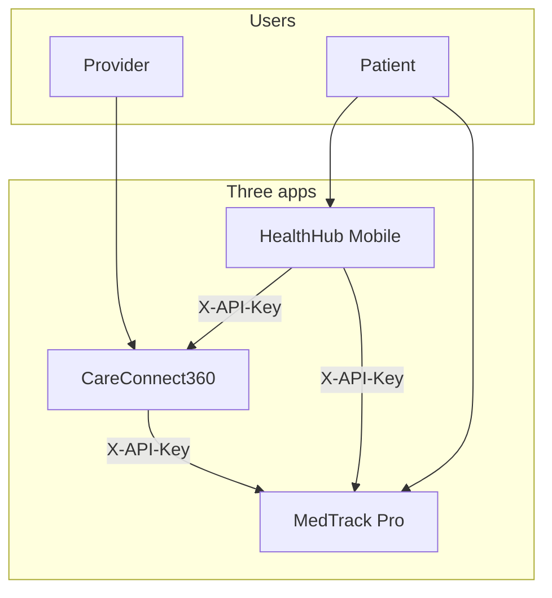
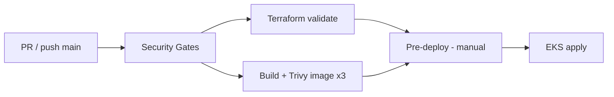

# 02 — Architecture

## Runtime (local and target production)

## CI/CD (simplified)

## OIDC trust (deploy)

GitHub Actions assumes `AWS_DEPLOY_ROLE_ARN` with `id-token: write` to run `terraform plan`, ECR login/push, and `kubectl apply` — **no static AWS access keys** in the workflow YAML.

See `.github/workflows/secure-ci-cd.yml` jobs `terraform-validate`, `build-and-scan-images`, and `pre-deploy-double-check`.
