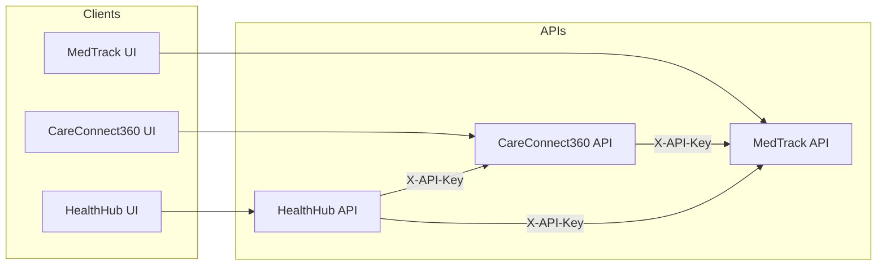

# Threat model, inherent risk, and risk analysis — Healthcare Apps

**Platform:** CareConnect360, HealthHub Mobile, MedTrack Pro (integrated healthcare suite)  
**Document type:** Security architecture review (qualitative)  
**Related:** [threat-model.md](./threat-model.md) (STRIDE matrix), [infrastructure-and-security.md](./infrastructure-and-security.md), [case-study/README.md](./case-study/README.md)

---

## 1. Purpose and scope

| Deliverable | Purpose |
|-------------|---------|
| **Threat model** | STRIDE coverage for PHI/PII, integration keys, and multi-app trust boundaries (see `threat-model.md`). |
| **Inherent risk** | Exposure if controls fail — especially cross-app `INTEGRATION_API_KEY` abuse and patient ID linkage. |
| **Risk analysis** | Likelihood × impact prioritisation for HIPAA-aligned treatment (mitigate, document, transfer where applicable). |

**Scope:** Application APIs (Express), browser clients (Vite), SQLite dev stores, Terraform AWS baseline (VPC, EKS, KMS, flow logs), Kubernetes deployments, GitHub Actions security gates. **Out of scope:** BAAs with cloud vendors, full HIPAA audit, physical clinic security.

**Regulatory note:** This documentation supports **HIPAA-oriented** engineering (minimum necessary, access controls, auditability). It is **not** a compliance attestation.

---

## 2. System context (C4-level)

**Primary assets:** JWT sessions, `INTEGRATION_API_KEY`, patient identifiers linking apps, medication and adherence data, care plans and appointments.

---

## 3. Trust boundaries

| ID | Boundary | Trust assumption |
|----|----------|-------------------|
| B1 | Browser ↔ own API | TLS in prod; no secrets in client bundle. |
| B2 | CareConnect360 ↔ MedTrack integration | Shared secret header; server-to-server only. |
| B3 | HealthHub ↔ other services | Profile-stored patient/user IDs must match authorised subjects. |
| B4 | CI runner ↔ AWS | OIDC role; no long-lived AWS keys in GitHub. |
| B5 | Pod ↔ Secrets Manager / ECR | IRSA or projected secrets; image from trusted registry. |

---

## 4. Top risks (summary)

| Risk | Area | Treatment |
|------|------|-----------|
| R1 | IDOR via forged `patientId` / `userId` on integration routes | Server-side session binding; never trust client IDs for authz. |
| R2 | Leaked `INTEGRATION_API_KEY` | Secrets Manager in prod; rotate; rate-limit; network policy. |
| R3 | PHI in logs or error payloads | Redact structured logging; generic client errors. |
| R4 | Stale dependency with known CVE | npm audit gate; Dependabot; Trivy fs/image. |
| R5 | IaC drift or public EKS endpoint | Terraform plan artifacts; EKS private API (see Terraform). |

---

## 5. Review cadence

- Update this file when **integration contracts**, **auth model**, or **deployment topology** change.
- Cross-check with [05-incident-log.md](./case-study/05-incident-log.md) after each significant CI or infra fix.
